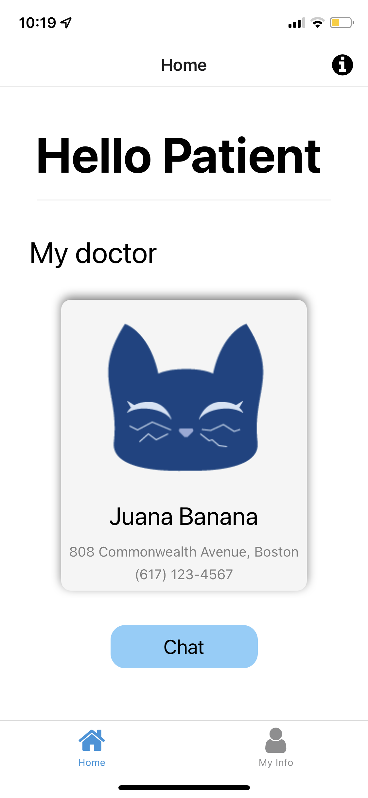
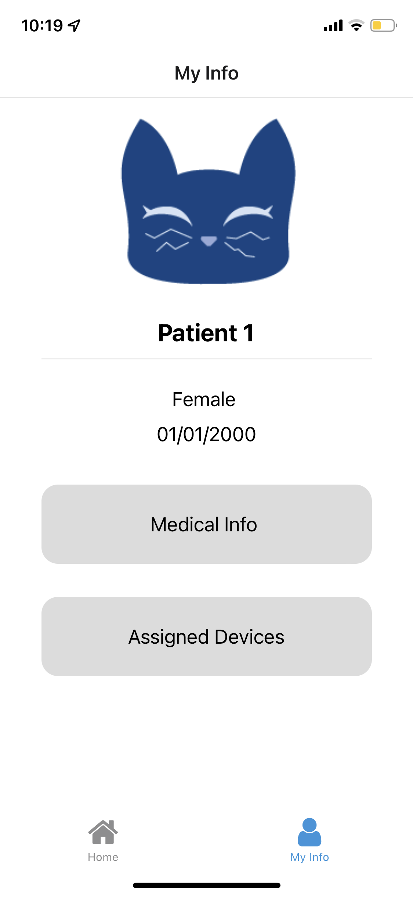

# Mobile Health App

Mobile user interface for 'health-application' platform developed with React Native.

### How to use
1. Clone repository
2. Install node 12 LTS
3. Install Expo CLI: `npm install -g expo-cli`
4. Run `npm start` on Terminal
5. Install and open the Expo App on mobile device

## Planned Features
- User login and registration using Google SSO
- Medical staff can:
  - See their patients and modify them
  - Assign devices to patients
  - Chat with patients

- Patients can:
  - See their doctors and nurses
  - Check their personal devices and medical information
  - Chat with medical staff

## Current Development 
- Patient View
  - Home screen
    

  - Personal Information
  